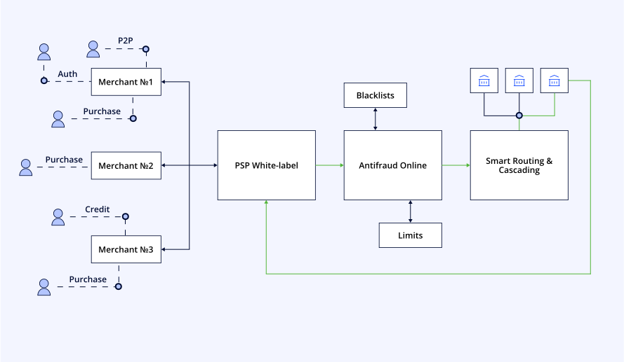

<div style={{ display: "flex", alignItems: "center", justifyContent: "center" }}>

<div>

# Провайдери платіжних послуг

Це рішення забезпечить вас усіма можливостями, що необхідні провайдерам платіжних послуг (PSP). Ви зможете надавати своїм мерчантам послуги з приймання платежів і при цьому не витрачати кошти розробку та підтримку власної платіжної інфраструктури.

</div>


<div style={{ width: "50%", flexShrink: 0, paddingLeft: "30px"}}>


</div>

</div>


## Переваги для бізнесу

import MultiColorCaptionsBlock from '@site/src/components/MultiColorCaptionsBlock/MultiColorCaptionsBlock.js';
import {businessBenefits} from './_mock';

<MultiColorCaptionsBlock props={businessBenefits} />

## Більше деталей про ...

import CardsCategoriesBlock from '@site/src/components/CardsCategoriesBlock/CardsCategoriesBlock.js';
import HowDifficult from '@site/src/components/HowDifficult/HowDifficult.js';
import {categoriesBlock} from './_mock';

<CardsCategoriesBlock props={categoriesBlock} />

## Як це працює для ваших клієнтів

При використанні PSP-моделі ваші користувачі (мерчанти) працюватимуть за такою схемою:

1. ### Мерчант реєструється у мерчант-порталі.
Це рішення дозволяє здійснювати міжнародні платежі із використанням різноманітних платіжних методів та валют. Це спрощує вихід на глобальний ринок як для вас, так і для мерчантів, з якими ви будете працювати. 
<HowDifficult number={3} caption="Складність інтеграції" />

2. ### Заголовок 2
Текст элемента списка 2.
<HowDifficult number={5} caption="Складність інтеграції" />

3. ### Заголовок 3
Текст элемента списка 3.
<HowDifficult number={1} caption="Складність інтеграції" />


## P2P payments

HTTP method: `POST`

Recommended way to sign requests is [HMAC-SHA1](https://en.wikipedia.org/wiki/HMAC) algorithm.
See an example on the right.

Authentication header: `X-API-AUTH: CPAY-HMAC ${API_KEY}:${SIGNATURE}`

```js
if (window.ApplePaySession) {
  console.log("The Apple Pay JS API is available.");

  const canMakePayments = ApplePaySession.canMakePayments();
  console.log("canMakePayments: " + JSON.stringify(canMakePayments));

  const merchantIdentifier = {MERCHANT_IDENTIFIER};
  ApplePaySession
    .canMakePaymentsWithActiveCard(merchantIdentifier);
    .then(canMakePayments => {
      console.log("canMakePayments: " + canMakePayments);
      if (canMakePayments) {...}
    }
}
```

```js
document.getElementById("apple-pay-button").onclick = event => {
  var paymentRequest = {
    currencyCode: 'UAH',
    countryCode: 'UA',
    total: {
      label: {PRODUCT_NAME},
      amount: {PAYMENT_AMOUNT}
    },
    merchantCapabilities: ['supports3DS'],
    supportedNetworks: ['masterCard', 'visa']
  }

var applePaySession = new ApplePaySession(3, paymentRequest);
```

```json
{
  "version":              "EC_v1",
  "data":                 "zTMZDPumdE7h8oY/+31VMZd60dMaxB...",
  "signature":            "MIAGCSqGSIb3DQEHA...",
  "header": {
    "ephemeralPublicKey": "MFkwEwYHKoZIzj0C...",
    "publicKeyHash":      "3AKqH/wPWdQIBpGIv1PC4uDTbGouPgWbmUlFGiHopig=",
    "transactionId":      "d6e63976191fdf051f7cb95e0e5da70a19c99a5576ececbfc0fd65ad2a7f2f74"
  }
}
```

## Можливості та сервіси
<div className="half-item">

- Платіжні посилання та QR-коди
- Мультивалютність
- Валютна конвертація
- 3D Secure 2.1
- Токенізація карткових даних
- Ідентифікація платників
- Робота з диспутами (оспорювані платежі)
- Управління балансом
- Мерчант-портал
- Брендовані чекаути
- Технічна документація

</div>

## Як це працює для ваших клієнтів

При використанні PSP-моделі ваші користувачі (мерчанти) працюватимуть за такою схемою:

1. Мерчант реєструється у мерчант-порталі.
2. Проходить онбординг за передбаченою вами процедурою.
3. Генерує платежі в автоматичному режимі через запити до API або створює **[платіжні посилання](http://example.com/)** вручну та передає їх далі своїм покупцям.

### Схема взаємодії сервісів




## Data types

Type name             | Represented as |         Values                        |                Example
--------------------- |----------------|-------------------------------------- | --------------------------------------
`UUID`                | String(36)     |                                       | `"a8d80c86-0c7b-41bc-b63d-1e78f80edcd9"`
`TIMESTAMP`           | String(23)     |                                       | `"2020-10-10T10:10:22.100"`
`MODE`                | String(≤32)    | `direct`, `hosted`                    |
`METHOD`                  | String(≤255)     | `purchase`, `capture`, `auth`, `void` |
`URL`                        | String(≤2048)  |                                       | `https://examle.com/some/path?with=query`
`IP`                        | String(7-45)     |                                       | `"8.8.8.8"` (IPv4), `"FE80::0202:B3FF:FE1E:8329"` (IPv6)
`GW_ID`               | String(≤1024)  |                                       | `4212523:GssqUUQa`
`BILLING_ID`          | String(≤1024)  |                                       | `123125124`
`CURRENCY`                | String(3)             |                                       | `"UAH"`, `"USD"`, `"EUR"`
`STATUS`                    | String(≤32)    |                                       | `"success"`
`STATUS_CODE`            | String(4)      |                                       | `"1000"`  ([Tranzzo payment status code](#status-codes))
`STATUS_DESCRIPTION`    | String(≤1024)  |                                       | `"Transaction is successful."` ([Tranzzo payment status code](#status-codes) description)
`ECI`                        | String(≤2)     |                                       | `"7"`
`MCC`                        | String(≤5)     |                                       | `"3455"`
`CC_NUMBER`           | String(13-20)  |                                       | `"4242424242424242"`
`CC_MASK`             | String(13-20)  |                                       | `"424242******4242"`

:::note

Some **content** with _Markdown_ `syntax`. Check [this `api`](#).

:::

:::tip

Some **content** with _Markdown_ `syntax`. Check [this `api`](#).

:::

:::info

Some **content** with _Markdown_ `syntax`. Check [this `api`](#).

:::

:::caution

Some **content** with _Markdown_ `syntax`. Check [this `api`](#).

:::

:::danger

Some **content** with _Markdown_ `syntax`. Check [this `api`](#).

:::


## Tabs

import Tabs from '@theme/Tabs';
import TabItem from '@theme/TabItem';

<Tabs>
<TabItem value="value" label="Values" default>

Type name             | Represented as |         Values                        |                Example
--------------------- |----------------|-------------------------------------- | --------------------------------------
`MODE`                | String(≤32)    | `direct`, `hosted`                    |
`METHOD`                  | String(≤255)     | `purchase`, `capture`, `auth`, `void` |

</TabItem>
<TabItem value="string" label="String">

Type name             | Represented as |         Values                        |                Example
--------------------- |----------------|-------------------------------------- | --------------------------------------
`UUID`                | String(36)     |                                       | `"a8d80c86-0c7b-41bc-b63d-1e78f80edcd9"`
`TIMESTAMP`           | String(23)     |                                       | `"2020-10-10T10:10:22.100"`
`MODE`                | String(≤32)    | `direct`, `hosted`                    |
`CC_NUMBER`           | String(13-20)  |                                       | `"4242424242424242"`
`CC_MASK`             | String(13-20)  |                                       | `"424242******4242"`

</TabItem>
<TabItem value="cc_mask" label="CC_MASK">

Type name             | Represented as |         Values                        |                Example
--------------------- |----------------|-------------------------------------- | --------------------------------------
`CC_MASK`             | String(13-20)  |                                       | `"424242******4242"`

</TabItem>
</Tabs>

## React Table With Filter

import MainTable from '@site/src/components/Table/MainTable.js';
import {data, columns} from './_mock';

<MainTable columns={columns} data={data} />

## WL block

import CategoriesIconBlock from '@site/src/components/CategoriesIconBlock/CategoriesIconBlock';

<CategoriesIconBlock/>

